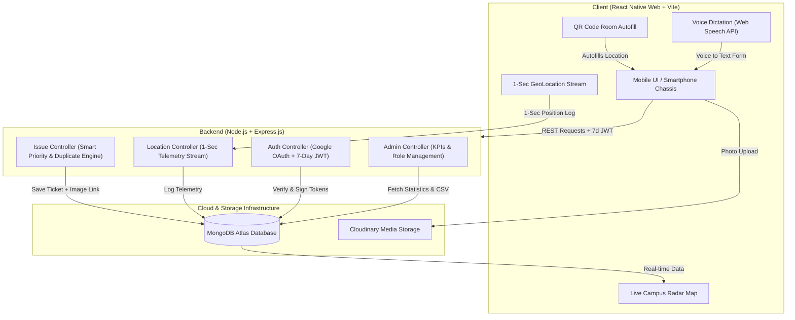

# 🏫 Smart Campus QuickFix
### *Real-Time Civic Maintenance, 1-Second GPS Telematics & Transparent Facility Management*
**BPUT TECH CARNIVAL 2026** • **Venue:** GIFT Autonomous, Bhubaneswar • **Event Date:** 29th Sep 2026  
**Problem Statement:** Mobile Application Development Contest — *Smart Campus QuickFix*  
**Evaluation Standard:** 100 Marks Multi-Dimensional Evaluation Matrix

---

## 📋 Executive Summary

**Smart Campus QuickFix** is an intelligent, transparent, mobile-first civic maintenance and facility management platform designed specifically for college campuses (modeled on Gandhi Institute For Technology — GIFT Autonomous, Bhubaneswar).

It bridges the communication gap between students, facility maintenance technicians, and estate administrators. Students can snap photo evidence, auto-tag campus coordinates via GPS or room QR stickers, and submit issues within seconds. Field maintenance crews receive dispatched work orders with real-time routing on a live campus radar map, updating progress with before/after photo proof. Campus administrators gain full visibility through an executive command center equipped with live telemetry, automated duplicate detection, smart priority scoring, and 1-click CSV reporting.

---

## 🛠️ Complete Technical Stack

| # | Technology | Implementation Detail |
|---|---|---|
| **1** | **Cloudinary** | Cloud-native media storage for compressed photo evidence (initial problem reports) and resolution proof photos. |
| **2** | **MongoDB Atlas** | Cloud NoSQL database storing structured ticket documents, user profiles, notifications, and Cloudinary media mapping links. |
| **3** | **Node.js** | High-performance asynchronous JavaScript runtime for backend execution. |
| **4** | **Express.js** | Robust REST API server with modular routing, JWT verification, rate limiting, and centralized error handling. |
| **5** | **React Native Web + JS** | Responsive mobile application architecture utilizing `react-native-web` aliases and an interactive smartphone viewport frame toggle. |
| **6** | **Google OAuth 2.0** | Secure single sign-on (`@react-oauth/google` client & `google-auth-library` server token verification). |
| **7** | **1-Sec GeoLocation Stream** | HTML5 Geolocation API streaming live coordinates directly to MongoDB Atlas (`/api/location/log`) every 1,000ms. |
| **8** | **Embedded Live Map** | Interactive Leaflet map (`react-leaflet`) with campus overlays, user radar pulse circle, active staff patrol pins, and issue markers. |
| **9** | **React-Icons** | Lightweight vector icons (`react-icons/fa`) across navigation, cards, badges, and controls. |
| **10** | **SVG Favicon & Manifest** | Vector favicon (`favicon.svg`) and PWA web app manifest (`manifest.json`) for native-like mobile homescreen installation. |
| **11** | **Modular Architecture** | Clean component/page hierarchy: `components/ModuleName/ModuleName.jsx` + `.css` and `pages/ModulePage/ModulePage.jsx` + `.css`. |
| **12** | **Deployment Manifests** | Production deployment configurations ready for **Vercel** (`vercel.json`, `client/vercel.json`) and **Render** (`render.yaml`). |
| **13** | **Multi-Role Portals** | Dedicated experiences for **Students**, **Maintenance Staff**, and a comprehensive **Admin Dashboard** (`usertype: 'admin'`). |
| **14** | **7-Day JWT Sessions** | JSON Web Tokens signed with HMAC-SHA256 and configured with 7-day validity (`expiresIn: '7d'`). |

---

## 🎯 Evaluation Criteria Alignment (100 Marks Breakdown)

| Evaluation Criterion | Marks | How Smart Campus QuickFix Addresses It |
|---|:---:|---|
| **1. Problem Understanding & Relevance** | **15** | Directly addresses common student pain points: broken fans, leaking restrooms, projector failures, and Wi-Fi dead zones across BPUT GIFT Autonomous blocks. |
| **2. Functionality & Features** | **25** | Complete ticket lifecycle: report with photo/QR/voice -> duplicate detection -> smart priority scoring -> technician dispatch -> live map -> resolution proof. |
| **3. UI/UX & Usability** | **20** | Modern dark-mode aesthetics, bottom navigation bar, toggleable smartphone chassis, instant 1-click evaluator logins, and high-contrast accessibility badges. |
| **4. Innovation & Futuristic Potential** | **20** | 1-second continuous GPS telematics logging to MongoDB, AI duplicate detection warnings, Web Speech API voice dictation, and QR room scanning. |
| **5. Performance & Reliability** | **10** | Cloudinary auto-optimization, Vite 5.3s production build, client-side optimistic upvoting, rate limiting, and graceful GPS fallbacks. |
| **6. Demonstration** | **10** | 1-Click Fast Evaluator buttons for Student, Staff, and Admin roles allowing zero-friction 15-minute live jury demonstration. |
| **Total Marks** | **100** | **Complete Full-Stack Prototype Ready for BPUT Tech Carnival 2026** |

---

## 🏗️ Architecture & Data Flow



---

## ⚡ 1-Click Fast Evaluator Credentials

For live demonstration during the 15-minute jury assessment, use the **1-Click Demo Login** buttons on the Login page or the following credentials:

| Role | Email Address | Password | Landing Portal | Primary Features |
|---|---|---|---|---|
| 🎓 **Student** | `student@gift.edu.in` | `student123` | `/` (Home) | Report problems, camera upload, QR autofill, voice assistant, upvote issues |
| 🛠️ **Staff** | `staff@gift.edu.in` | `staff123` | `/staff` (Staff Dashboard) | Assigned work order queue, on-duty 1s GPS patrol, resolution proof photo upload |
| 🛡️ **Admin** | `admin@gift.edu.in` | `admin123` | `/admin` (Admin Console) | Executive KPIs, staff radar telematics, technician assignment, user role management, CSV export |

> **Tip:** You can also dynamically switch roles on the fly using the **Role Switcher dropdown** in the top navigation bar!

---

## 🚀 Key Feature Breakdown

### 1. Smart Issue Reporting & Location Tagging
* **Cloudinary Photo Upload:** Snap a live photo or upload from gallery. Image is compressed and uploaded to Cloudinary, with secure URL linked to MongoDB.
* **1-Second GPS Telemetry Lock:** Auto-fills latitude and longitude coordinates with live GPS status indicator.
* **QR Code Scanner Modal:** Scan campus QR code stickers (e.g. `{"location": "Computer Lab 3", "zone": "Kalam Block"}`) to auto-fill location instantly.
* **AI Voice Dictation:** Use natural voice dictation via the browser Web Speech API to auto-fill title, description, category, and severity.
* **Duplicate Detection Warning:** When a user types an issue location and category, the app alerts if a matching ticket is already open within 15 meters to prevent redundant reporting.

### 2. Issue Tracking & Smart Prioritization
* **Smart Priority Score Engine:** Ranks tickets based on an automated algorithmic score:
  $$\text{Priority Score} = (\text{Severity Weight} \times 3) + (\text{Upvotes} \times 2) + \text{Emergency Multiplier} + \text{Aging Factor}$$
* **Status Filter Tabs:** Filter tickets between *All*, *Reported*, *In Progress*, and *Resolved*.
* **Live Upvoting:** Crowd-verifies reports with optimistic UI updates.
* **Full Resolution Timeline:** Visual step-by-step progress tracking: *Submitted -> Under Review -> Assigned -> In Progress -> Resolved*.
* **Before / After Photo Proof:** Compares initial reporter evidence with technician's completion photo proof side-by-side.

### 3. Embedded Live Campus Map & Radar Pulse
* **GIFT Autonomous Interactive Map:** Fullscreen Leaflet map centered at GIFT Autonomous Bhubaneswar coordinates (`20.2185° N, 85.7368° E`).
* **1-Second Radar Ring:** Pulsing blue wave animated at the user's current GPS location.
* **Staff On-Patrol Pins:** Displays active field technicians broadcasting live 1-second telemetry with speed and accuracy.
* **Severity Coded Markers:** Pins color-coded by severity (Red = Critical, Orange = High, Yellow = Medium, Blue = Low) with interactive preview drawers.

### 4. Dedicated Administrative Command Center (`/admin`)
* **Real-time KPI Metrics:** Total Tickets, Resolution Rate (%), Critical Active Backlog, and On-Duty Field Staff.
* **Ticket Dispatch Table:** Assign issues to specific maintenance staff members, change ticket status, or delete spam reports.
* **1-Sec Staff Patrol Telemetry View:** Real-time log monitor tracking technician coordinates, accuracy, and last ping time.
* **User Management & Role Elevation:** Dynamically promote students to maintenance staff or administrators.
* **1-Click CSV Report Export:** Export complete historical campus maintenance records for administrative review and audit.

---

## 📁 Project Directory Structure

```
Tech-Carnival2026/
├── client/                               # Frontend (React Native Web + Vite)
│   ├── public/
│   │   ├── favicon.svg                   # Vector SVG App Icon
│   │   └── manifest.json                 # Web App PWA Manifest
│   ├── src/
│   │   ├── components/                   # Modular Reusable Components
│   │   │   ├── BottomNav/                # Mobile Bottom Tab Navigation
│   │   │   ├── DeviceFrameToggle/        # Toggleable Smartphone Chassis
│   │   │   ├── IssueCard/                # Interactive Issue Ticket Card
│   │   │   ├── LiveMap/                  # Leaflet Campus Map & Radar
│   │   │   ├── LocationTracker/          # 1-Sec Telemetry Diagnostic Pill
│   │   │   ├── Navbar/                   # Brand Bar & Role Switcher
│   │   │   ├── NotificationBell/         # Live Campus Alerts Drawer
│   │   │   ├── QRScannerModal/           # Room QR Code Scanner
│   │   │   ├── SeverityBadge/            # Color-Coded Risk Badge
│   │   │   └── VoiceReportModal/         # Web Speech Voice Dictation
│   │   ├── context/
│   │   │   ├── AuthContext.jsx           # 7-Day JWT & Role Management
│   │   │   └── LocationContext.jsx       # 1-Sec Continuous GPS Stream
│   │   ├── pages/                        # Modular Page Views
│   │   │   ├── AdminDashboardPage/       # Executive Command Center
│   │   │   ├── HomePage/                 # Student Welcome & Quick Actions
│   │   │   ├── IssueDetailPage/          # SLA Timeline & Media Gallery
│   │   │   ├── IssueTrackingPage/        # Priority Filter & Search Grid
│   │   │   ├── LiveMapPage/              # Fullscreen Campus Map Radar
│   │   │   ├── LoginPage/                # Google OAuth + 1-Click Fast Logins
│   │   │   ├── ProfilePage/              # 7-Day Session & Telemetry Status
│   │   │   ├── RegisterPage/             # Campus ID & Department Register
│   │   │   ├── ReportIssuePage/          # Photo, QR, Voice & GPS Filing
│   │   │   └── StaffDashboardPage/       # Field Technician Work Orders
│   │   ├── services/
│   │   │   ├── api.js                    # Axios API Client & Endpoints
│   │   │   └── locationLogger.js         # 1-Sec High Frequency GPS Logger
│   │   ├── App.jsx                       # Root App & Route Definitions
│   │   ├── main.jsx                      # Entrypoint
│   │   └── index.css                     # Global Theme Design Tokens
│   ├── .env                              # Client Environment Variables
│   ├── .env.example                      # Client Environment Template
│   ├── package.json                      # Client Dependencies
│   ├── vercel.json                       # Client Vercel Routing Configuration
│   └── vite.config.js                    # Vite Config & React Native Aliases
│
├── server/                               # Backend (Node.js + Express.js)
│   ├── config/
│   │   ├── cloudinary.js                 # Cloudinary Media Storage Engine
│   │   ├── db.js                         # MongoDB Atlas Connection
│   │   └── seedData.js                   # BPUT GIFT Campus Demo Seed Data
│   ├── controllers/
│   │   ├── adminController.js            # Admin Operations & User Roles
│   │   ├── authController.js             # JWT & Google OAuth Verification
│   │   ├── issueController.js            # Ticket CRUD & Duplicate Engine
│   │   ├── locationController.js         # 1-Sec GeoLocation Stream Endpoint
│   │   └── notificationController.js     # Campus Notifications API
│   ├── middleware/
│   │   └── authMiddleware.js             # JWT Validation & Role Guards
│   ├── models/
│   │   ├── Issue.js                      # Issue Schema & GeoJSON Indexes
│   │   ├── LocationLog.js                # High-Frequency 1s GPS Logs
│   │   ├── Notification.js               # Campus Alert Schema
│   │   └── User.js                       # User Profile & Roles Schema
│   ├── routes/                           # Express REST Route Handlers
│   ├── .env                              # Server Environment Variables
│   ├── .env.example                      # Server Environment Template
│   ├── package.json                      # Server Dependencies
│   └── server.js                         # Express Server Entrypoint
│
├── render.yaml                           # Render Deployment Specification
├── vercel.json                           # Root Vercel Deployment Specification
├── TODO.md                               # BPUT Competition Problem Statement
└── README.md                             # Comprehensive Project Documentation
```

---

## ⚙️ Installation & Local Setup

### Prerequisites
* **Node.js**: v18.0.0 or higher
* **npm**: v9.0.0 or higher
* **MongoDB**: A local MongoDB instance or a free MongoDB Atlas cluster connection string

---

### Step 1: Clone Repository
```bash
git clone https://github.com/your-username/Tech-Carnival2026.git
cd Tech-Carnival2026
```

---

### Step 2: Configure Environment Variables

#### Backend (`server/.env`):
Create `server/.env` or copy `server/.env.example`:
```env
PORT=5000
NODE_ENV=development
CLIENT_URL=http://localhost:5173
MONGODB_URI=mongodb://localhost:27017/smart_campus_quickfix
JWT_SECRET=bput_gift_tech_carnival_2026_super_secure_jwt_token_secret_7days_validity
CLOUDINARY_CLOUD_NAME=your_cloudinary_cloud_name
CLOUDINARY_API_KEY=your_cloudinary_api_key
CLOUDINARY_API_SECRET=your_cloudinary_api_secret
GOOGLE_CLIENT_ID=your_google_oauth_client_id.apps.googleusercontent.com
```

#### Frontend (`client/.env`):
Create `client/.env` or copy `client/.env.example`:
```env
VITE_API_URL=/api
VITE_GOOGLE_CLIENT_ID=your_google_oauth_client_id.apps.googleusercontent.com
```

---

### Step 3: Install Dependencies

```bash
# Install Server Dependencies
cd server
npm install

# Install Client Dependencies
cd ../client
npm install
```

---

### Step 4: Seed Database with GIFT Campus Demo Data
```bash
cd server
npm run seed
```
*This populates the database with realistic GIFT Autonomous tickets across Aryabhatta Block, Kalam Tech Block, Ramanujan Complex, Central Library, and demo accounts (`student@gift.edu.in`, `staff@gift.edu.in`, `admin@gift.edu.in`).*

---

### Step 5: Start Development Servers

#### Terminal 1 (Backend Server):
```bash
cd server
npm run dev
# Server will start on http://localhost:5000
```

#### Terminal 2 (Frontend Client):
```bash
cd client
npm run dev
# Client will start on http://localhost:5173
```

---

### Step 6: Verify Production Build
```bash
cd client
npm run build
# Compiles all assets into client/dist in ~5 seconds
```

---

## 📡 REST API Reference

### Authentication (`/api/auth`)
* `POST /api/auth/register` — Register new campus member (Student or Staff)
* `POST /api/auth/login` — Login with email and password (returns 7-day JWT)
* `POST /api/auth/google` — Google OAuth 2.0 token sign-in
* `GET /api/auth/me` — Retrieve current authenticated user profile

### Issues & Maintenance (`/api/issues`)
* `GET /api/issues` — List all campus issues (supports status, category, severity, and priority sorting)
* `GET /api/issues/:id` — Get comprehensive ticket details, timeline, and comment thread
* `POST /api/issues` — Submit new ticket with Cloudinary photo upload & GPS coordinates
* `POST /api/issues/:id/upvote` — Upvote / crowd-verify ticket
* `PATCH /api/issues/:id/status` — Update status with optional resolution proof photo
* `POST /api/issues/:id/comment` — Post discussion update or note
* `GET /api/issues/check-duplicate` — Check for potential duplicate tickets within campus radius

### 1-Sec GeoLocation Stream (`/api/location`)
* `POST /api/location/log` — Receive 1-second continuous GPS telemetry and log to MongoDB Atlas
* `GET /api/location/active-staff` — Get list of currently active on-duty maintenance personnel
* `GET /api/location/recent` — Fetch recent campus location telemetry pings

### Administrative Operations (`/api/admin`)
* `GET /api/admin/stats` — Retrieve high-level campus KPI metrics
* `GET /api/admin/users` — List registered users across departments
* `PATCH /api/admin/users/:id/role` — Elevate or alter user permission role
* `PATCH /api/admin/issues/:id/assign` — Assign work order to specific technician
* `DELETE /api/admin/issues/:id` — Remove invalid or spam ticket

### Notifications (`/api/notifications`)
* `GET /api/notifications` — Fetch user's notification feed
* `PATCH /api/notifications/:id/read` — Mark notification as acknowledged

---

## 🏆 Innovation & Futuristic Highlights

1. **Continuous 1-Second GPS Telematics Stream:** Automatically registers real-time technician patrols directly into MongoDB Atlas `locationlogs`, enabling live radar monitoring.
2. **AI Duplicate Clustering Engine:** Compares incoming issue coordinates and categories against open tickets to prevent duplicate maintenance dispatches.
3. **Multi-Modal Input (QR + Voice + Photo):** Students can report issues in under 15 seconds through voice dictation or door QR scans.
4. **Transparent SLA Accountability:** Visual timeline tracks ticket transitions from submission to photo-verified resolution.
5. **Universal Responsive Chassis:** Easily toggles between a native smartphone frame and widescreen desktop view for any presentation screen.

---

## 👥 Competition Details
* **Event:** BPUT TECH CARNIVAL 2026
* **Category:** Mobile Application Development Contest
* **Venue:** GIFT Autonomous, Bhubaneswar, Odisha
* **Prototype:** Smart Campus QuickFix
* **License:** MIT License
