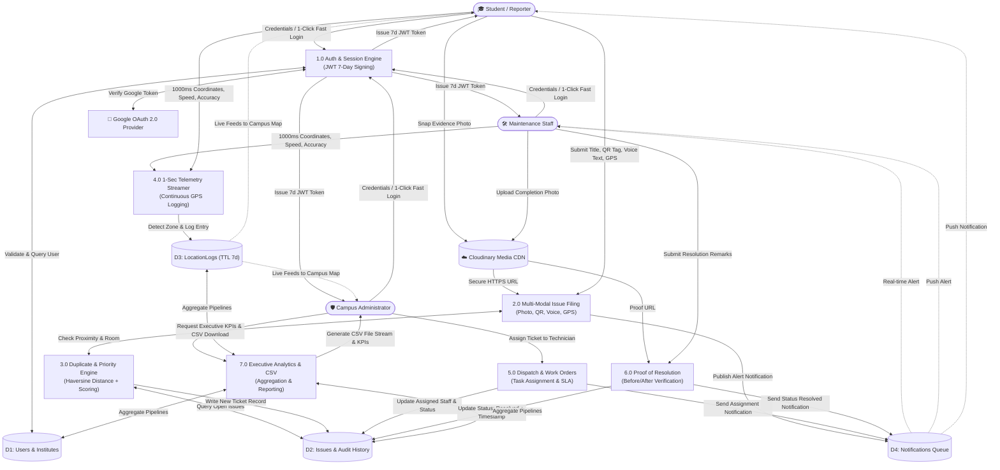
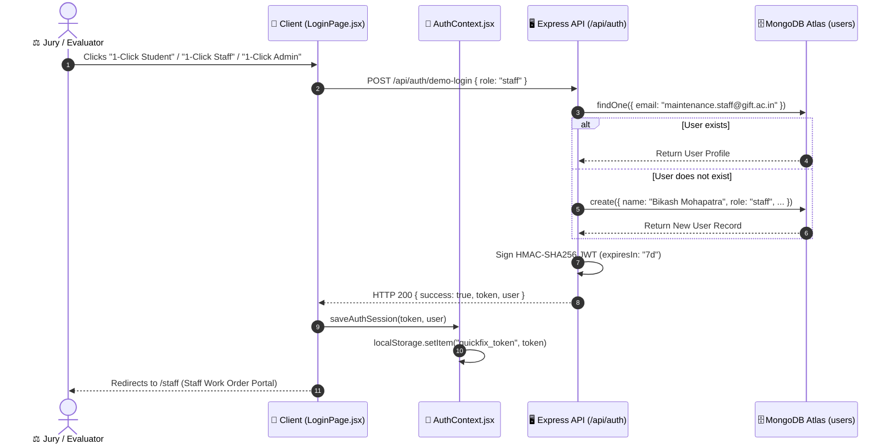
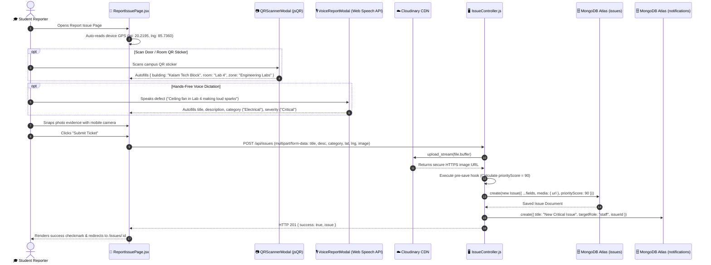
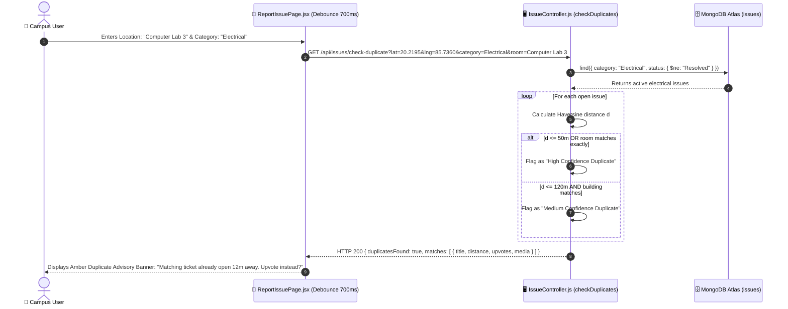
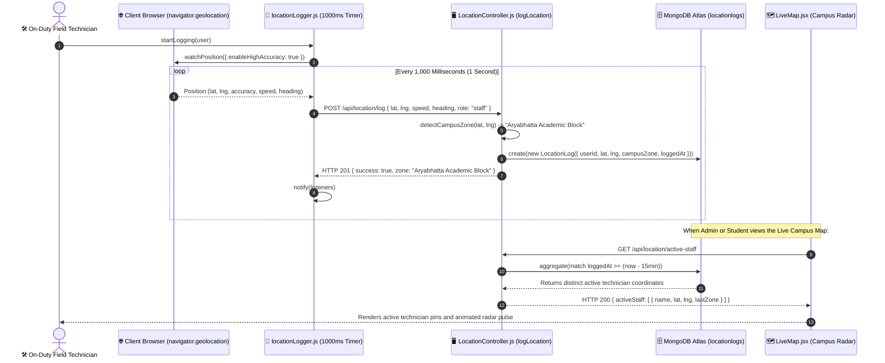
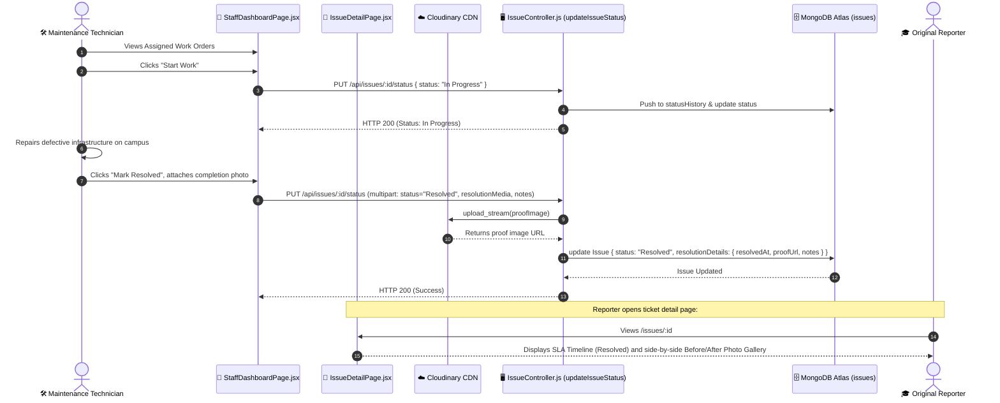

# 🔄 Data Flow & Interaction Architecture (DFD)
## Smart Campus QuickFix — Data Flow Diagrams, Sequences & API Contracts
**Event:** BPUT Tech Carnival 2026 • **Venue:** GIFT Autonomous, Bhubaneswar  
**Date:** September 2026 • **Version:** 1.0.0 • **Document Status:** Final Production Specification

---

## 1. System Data Flow Architecture (DFD Level 1)

The following diagram illustrates how data flows between users (Students, Staff, Administrators), application processes, and persistent data stores.



---

## 2. Key Interaction Sequence Diagrams

### 2.1 Flow 1: 1-Click Fast Evaluator Login Sequence
Enables frictionless access for competition jury members without requiring manual input.



---

### 2.2 Flow 2: Multi-Modal Issue Reporting Sequence
Demonstrates how photo uploads, QR room tags, voice dictation, and GPS coordinates are orchestrated during ticket creation.



---

### 2.3 Flow 3: Real-Time Spatial Duplicate Detection & In-Form Advisory
Prevents redundant tickets by checking geographical proximity and room identifiers while the user is typing.



---

### 2.4 Flow 4: High-Frequency 1-Second GPS Telematics Stream
Maintains live campus telemetry for staff tracking, zone geofencing, and the radar map.



---

### 2.5 Flow 5: Field Staff Work Order Execution & Photo Proof Verification
Guarantees transparent accountability through verifiable completion proof.



---

## 3. RESTful API Data Contracts

### 3.1 Authentication Endpoints (`/api/auth`)

#### `POST /api/auth/register`
* **Request Payload:**
  ```json
  {
    "name": "Rohan Sharma",
    "email": "rohan.sharma@gift.edu.in",
    "password": "securePassword123",
    "role": "student",
    "department": "Computer Science & Engineering",
    "identifier": "GIFT-2022-CSE-042",
    "phone": "+91 9876543210",
    "institute": "Gandhi Institute For Technology (GIFT Autonomous)"
  }
  ```
* **Response Payload (HTTP 201):**
  ```json
  {
    "success": true,
    "message": "User registered successfully with 7-day active session",
    "token": "eyJhbGciOiJIUzI1NiIsInR5cCI6IkpXVCJ9...",
    "user": {
      "id": "66f7f1a1e0b123456789abcd",
      "name": "Rohan Sharma",
      "email": "rohan.sharma@gift.edu.in",
      "role": "student",
      "institute": "Gandhi Institute For Technology (GIFT Autonomous)",
      "department": "Computer Science & Engineering",
      "identifier": "GIFT-2022-CSE-042",
      "avatar": "https://images.unsplash.com/photo-..."
    }
  }
  ```

#### `POST /api/auth/demo-login`
* **Request Payload:**
  ```json
  {
    "role": "staff"
  }
  ```
* **Response Payload (HTTP 200):**
  ```json
  {
    "success": true,
    "message": "Logged in as demo staff with 7-day token",
    "token": "eyJhbGciOiJIUzI1NiIsInR5cCI6IkpXVCJ9...",
    "user": {
      "id": "66f7f1a1e0b987654321fedc",
      "name": "Bikash Mohapatra (Staff)",
      "email": "maintenance.staff@gift.ac.in",
      "role": "staff",
      "institute": "BPUT Tech Campus",
      "department": "Campus Electrical & Facilities Maintenance"
    }
  }
  ```

---

### 3.2 Issues & Work Orders Endpoints (`/api/issues`)

#### `POST /api/issues`
* **Content-Type:** `multipart/form-data`
* **Form Fields:**
  * `title`: "Broken ceiling fan making grinding noise"
  * `description`: "Ceiling fan regulator does not switch off and blade is wobbling dangerously."
  * `category`: "Electrical & Lighting"
  * `severity`: "High"
  * `building`: "Aryabhatta Academic Block"
  * `room`: "Room 302"
  * `landmark`: "Near East Staircase"
  * `latitude`: 20.2195
  * `longitude`: 85.7360
  * `qrCodeTag`: "GIFT-ARYA-R302"
  * `image`: `[Binary Image File]`
* **Response Payload (HTTP 201):**
  ```json
  {
    "success": true,
    "message": "Campus issue recorded successfully",
    "issue": {
      "_id": "66f7f2b2e0b555555555aaaa",
      "title": "Broken ceiling fan making grinding noise",
      "description": "Ceiling fan regulator does not switch off...",
      "category": "Electrical & Lighting",
      "severity": "High",
      "priorityScore": 70,
      "status": "Submitted",
      "location": {
        "building": "Aryabhatta Academic Block",
        "room": "Room 302",
        "landmark": "Near East Staircase",
        "latitude": 20.2195,
        "longitude": 85.7360,
        "qrCodeTag": "GIFT-ARYA-R302"
      },
      "media": {
        "url": "https://res.cloudinary.com/.../fan_evidence.jpg",
        "provider": "cloudinary"
      },
      "upvotesCount": 0,
      "isDuplicate": false,
      "statusHistory": [
        {
          "status": "Submitted",
          "changedAt": "2026-09-28T09:15:00.000Z",
          "changedBy": "Rohan Sharma",
          "remarks": "Issue reported to campus administration"
        }
      ],
      "createdAt": "2026-09-28T09:15:00.000Z"
    },
    "potentialDuplicate": null
  }
  ```

#### `GET /api/issues/check-duplicate`
* **Query Parameters:** `latitude=20.2195&longitude=85.7360&category=Electrical & Lighting&room=Room 302`
* **Response Payload (HTTP 200):**
  ```json
  {
    "success": true,
    "duplicatesFound": true,
    "matches": [
      {
        "_id": "66f7e8a9e0b111111111bbbb",
        "title": "Ceiling fan regulator damaged",
        "description": "Fan speed cannot be controlled in room 302",
        "status": "Submitted",
        "severity": "Medium",
        "distanceMeters": 4,
        "upvotesCount": 3,
        "matchConfidence": "High",
        "media": {
          "url": "https://res.cloudinary.com/.../fan.jpg"
        }
      }
    ]
  }
  ```

#### `PUT /api/issues/:id/status`
* **Content-Type:** `multipart/form-data`
* **Form Fields:**
  * `status`: "Resolved"
  * `resolutionNotes`: "Replaced faulty capacitor and balanced the blade spindle."
  * `resolutionMedia`: `[Binary Completion Photo File]`
* **Response Payload (HTTP 200):**
  ```json
  {
    "success": true,
    "message": "Status updated to Resolved",
    "issue": {
      "_id": "66f7f2b2e0b555555555aaaa",
      "status": "Resolved",
      "resolutionDetails": {
        "resolvedAt": "2026-09-28T10:45:00.000Z",
        "resolvedByName": "Bikash Mohapatra",
        "resolutionNotes": "Replaced faulty capacitor and balanced the blade spindle.",
        "resolutionMediaUrl": "https://res.cloudinary.com/.../fan_repaired.jpg"
      },
      "statusHistory": [
        { "status": "Submitted", "changedAt": "..." },
        { "status": "In Progress", "changedAt": "..." },
        { "status": "Resolved", "changedAt": "2026-09-28T10:45:00.000Z", "changedBy": "Bikash Mohapatra" }
      ]
    }
  }
  ```

---

### 3.3 High-Frequency 1-Sec Telematics Endpoints (`/api/location`)

#### `POST /api/location/log`
* **Request Payload (Transmitted every 1,000ms):**
  ```json
  {
    "latitude": 20.21952,
    "longitude": 85.73604,
    "accuracy": 4,
    "speed": 1.4,
    "heading": 85,
    "altitude": 48,
    "batteryLevel": 88,
    "customUserName": "Bikash Mohapatra",
    "customRole": "staff"
  }
  ```
* **Response Payload (HTTP 201):**
  ```json
  {
    "success": true,
    "loggedAt": "2026-09-28T09:20:01.450Z",
    "zone": "Main Academic Block (MAB)",
    "logId": "66f7f333e0b777777777cccc"
  }
  ```

#### `GET /api/location/active-staff`
* **Response Payload (HTTP 200):**
  ```json
  {
    "success": true,
    "count": 2,
    "activeStaff": [
      {
        "id": "66f7f1a1e0b987654321fedc",
        "name": "Bikash Mohapatra (Staff)",
        "role": "staff",
        "lastZone": "Main Academic Block (MAB)",
        "lat": 20.21952,
        "lng": 85.73604,
        "lastPing": "2026-09-28T09:20:01.450Z"
      }
    ]
  }
  ```

---

### 3.4 Administrative Command Center Endpoints (`/api/admin`)

#### `GET /api/admin/stats`
* **Response Payload (HTTP 200):**
  ```json
  {
    "success": true,
    "stats": {
      "totalIssues": 42,
      "submittedCount": 11,
      "inProgressCount": 8,
      "resolvedCount": 23,
      "criticalCount": 3,
      "resolutionRate": 55,
      "avgResolutionHours": 2.4,
      "activeStaffCount": 4,
      "categoryStats": [
        { "_id": "Electrical & Lighting", "count": 14 },
        { "_id": "Water Leakage & Plumbing", "count": 10 },
        { "_id": "Cleanliness & Sanitation", "count": 8 }
      ],
      "buildingStats": [
        { "_id": "Aryabhatta Academic Block", "count": 16 },
        { "_id": "Central Library", "count": 9 },
        { "_id": "Kalam Tech Block", "count": 8 }
      ]
    }
  }
  ```

---

*End of Data Flow & Interaction Architecture Document.*
