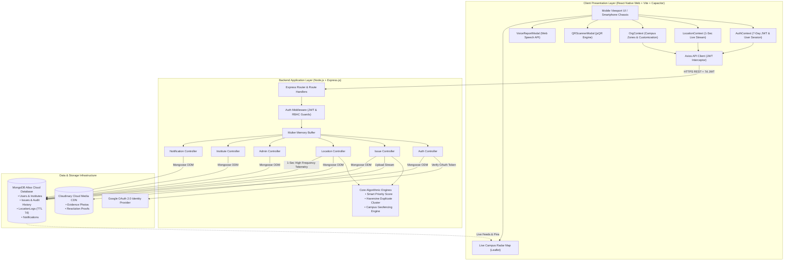
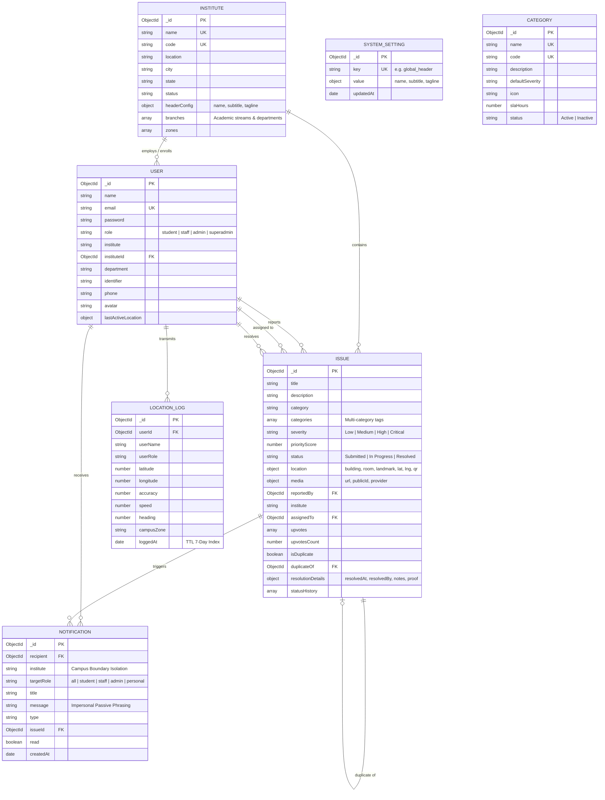
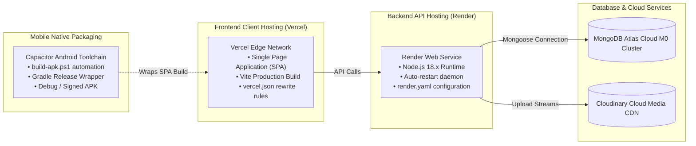

# 📐 Software Design Document (SDD)
## Smart Campus QuickFix — Architecture & Detailed Design
**Event:** BPUT Tech Carnival 2026 • **Venue:** GIFT Autonomous, Bhubaneswar  
**Date:** September 2026 • **Version:** 1.0.0 • **Document Status:** Final Production Architecture

---

## 1. Architectural Overview

### 1.1 Architectural Pattern
**Smart Campus QuickFix** employs a decoupled, multi-tiered **Client-Server Service-Oriented Architecture (SOA)** featuring:
1. **Presentation Layer (Client):** A responsive, mobile-first Single Page Application (SPA) built using **React 18**, **React Router v6**, **React Native Web** aliases, and **Vite**, packaged for Android using **Capacitor**.
2. **Application / Business Logic Layer (Server):** A high-throughput, asynchronous **Node.js** and **Express.js** RESTful API server implementing Role-Based Access Control (RBAC), spatial algorithms, duplicate filtering, and telematics ingestion.
3. **Data Persistence Layer (Database):** A cloud-hosted **MongoDB Atlas NoSQL** database utilizing geospatial 2dsphere indexes and automated Time-To-Live (TTL) document expiration.
4. **External Cloud Services:** **Cloudinary** for on-the-fly media optimization and storage, and **Google OAuth 2.0** for Single Sign-On.

### 1.2 System Architecture Diagram



---

## 2. Backend Design & Component Decomposition

### 2.1 Server Entrypoint & Middleware Pipeline (`server.js`)
The backend is structured around a streamlined Express application pipeline:
- **CORS Configuration:** Enables permissive cross-origin requests (`origin: '*'`) to accommodate mobile devices, local development ports, and cloud deployments.
- **Body Parsers:** Configured with extended limits (`limit: '15mb'`) to support base64 image strings and high-volume geolocation payloads.
- **Static File Serving:** Serves fallback local media from `/uploads` if cloud upload is unconfigured.
- **Health Check Endpoint (`/api/health`):** Reports database connectivity status, Cloudinary status, and server uptime.
- **Global Error Handling:** Intercepts unhandled rejections and formats structured JSON responses.

### 2.2 Controller Architecture
The backend isolates business operations into distinct controllers:

| Controller | Responsibilities | Key Functions |
|---|---|---|
| [`authController.js`](file:///e:/Semesters/7th%20Sem/Tech-Carnival2026/server/controllers/authController.js) | Identity, authentication, token issuance, demo evaluation logins. | `register()`, `login()`, `getMe()`, `demoLogin()` |
| [`issueController.js`](file:///e:/Semesters/7th%20Sem/Tech-Carnival2026/server/controllers/issueController.js) | Issue lifecycle, duplicate detection, media upload, upvoting, status updates. | `createIssue()`, `getIssues()`, `getIssueById()`, `updateIssueStatus()`, `upvoteIssue()`, `checkDuplicates()`, `assignIssue()` |
| [`locationController.js`](file:///e:/Semesters/7th%20Sem/Tech-Carnival2026/server/controllers/locationController.js) | 1-second continuous GPS stream ingestion, geofencing, recent active staff queries. | `logLocation()`, `getLatestLocations()`, `getLocationHistory()`, `getCampusZones()` |
| [`adminController.js`](file:///e:/Semesters/7th%20Sem/Tech-Carnival2026/server/controllers/adminController.js) | Executive KPI aggregations, user role elevation, technician assignment, duplicate merging. | `getDashboardStats()`, `getAllUsers()`, `updateUserRole()`, `assignTechnician()`, `mergeDuplicates()`, `deleteIssue()` |
| [`instituteController.js`](file:///e:/Semesters/7th%20Sem/Tech-Carnival2026/server/controllers/instituteController.js) | Multi-campus tenancy management, college registration, normal admin institute header branding, academic branches/streams registry, global superadmin overview. | `getInstitutes()`, `createInstitute()`, `updateInstitute()`, `deleteInstitute()`, `getMyInstitute()`, `updateMyInstituteHeader()`, `getMyInstituteBranches()`, `updateMyInstituteBranches()`, `getInstituteBranches()` |
| [`notificationController.js`](file:///e:/Semesters/7th%20Sem/Tech-Carnival2026/server/controllers/notificationController.js) | Strict campus-isolated notification routing, impersonal passive formatting, role/personal targeting. | `getNotifications()`, `markAsRead()` |
| [`settingsController.js`](file:///e:/Semesters/7th%20Sem/Tech-Carnival2026/server/controllers/settingsController.js) | Central global platform settings (strictly Super Admin authorized) for platform name, subtitle, and mission branding. | `getGlobalHeader()`, `updateGlobalHeader()` |
| [`categoryController.js`](file:///e:/Semesters/7th%20Sem/Tech-Carnival2026/server/controllers/categoryController.js) | Standardized facility category taxonomy, default severities, and SLA turnaround hour governance. | `getCategories()`, `createCategory()`, `updateCategory()`, `deleteCategory()` |

### 2.3 Middleware & Security (`middleware/authMiddleware.js`)
- `protect`: Extracts the `Bearer <token>` from the HTTP `Authorization` header, verifies the JWT using the secret key, fetches the user record from MongoDB, and attaches it to `req.user`.
- `isAdmin`: Ensures `req.user.role === 'admin'` or `'superadmin'`.
- `isStaff`: Ensures `req.user.role` is `'staff'`, `'admin'`, or `'superadmin'`.
- `isSuperAdmin`: Restricts access exclusively to global governance administrators (`'superadmin'`).

### 2.4 Cloud Media Architecture (`config/cloudinary.js`)
Photo uploads are processed through a resilient two-tier media handler:
1. **Primary Path (Cloudinary):** Uses `multer.memoryStorage()` to hold the incoming buffer in memory, streams it directly to Cloudinary using `cloudinary.uploader.upload_stream`, and stores the resulting HTTPS URL.
2. **Fallback Path (Local Storage):** If Cloudinary environment keys are not configured, `multer.diskStorage()` stores files in `server/uploads/` and generates local server URLs (`/uploads/filename.jpg`), guaranteeing that offline or demo environments never crash during jury presentation.

---

## 3. Database Schema & Data Models

### 3.1 Entity-Relationship (ER) Diagram



### 3.2 Data Models In-Depth
1. **User Schema (`models/User.js`):** Stores user identity, hashed credentials, assigned role, institute affiliation, student/staff identifier, and last known GPS telemetry coordinates.
2. **Issue Schema (`models/Issue.js`):** Central document representing maintenance tickets. Embeds location coordinates, Cloudinary media pointers, resolution details (notes and proof photo URL), upvote references, multi-category tags (`categories: [String]`), and a full chronological `statusHistory` array.
3. **LocationLog Schema (`models/LocationLog.js`):** Captures high-frequency 1-second telematics pings. Features a MongoDB TTL index on `loggedAt`:
   ```javascript
   locationLogSchema.index({ loggedAt: 1 }, { expireAfterSeconds: 604800 }); // 7 Days
   ```
4. **Notification Schema (`models/Notification.js`):** Handles internal campus alerts with strict multi-campus isolation via `institute`, supporting role broadcasts or private direct routing (`targetRole: 'personal'`). Employs passive phrasing for clarity.
5. **Institute Schema (`models/Institute.js`):** Manages multi-campus tenancy, storing institutional codes (e.g. `SILICON`, `BPUT-MAIN`), zones, contact credentials, customized header branding (`headerConfig: { name, subtitle, tagline }`), and active academic streams (`branches: [String]`).
6. **SystemSetting Schema (`models/SystemSetting.js`):** Key-value document store for apex governance, securing the central platform-wide header branding (`key: 'global_header'`) accessible exclusively to Super Administrators.
7. **Category Schema (`models/Category.js`):** Maintains the standardized facility maintenance taxonomy, default severity levels, icons, and target SLA turnaround hours.

---

## 4. Core Algorithmic Formulations

### 4.1 Smart Priority Score Algorithm
The issue priority score is computed dynamically via a Mongoose `pre-save` hook in [`Issue.js`](file:///e:/Semesters/7th%20Sem/Tech-Carnival2026/server/models/Issue.js#L174-L184).

$$\text{Priority Score} = \min\Big(\text{Base}(\text{Severity}) + \min(\text{Upvotes} \times 5,\, 20),\, 100\Big)$$

Where:
$$\text{Base}(\text{Severity}) = \begin{cases} 
90 & \text{if Severity} = \text{Critical} \\ 
70 & \text{if Severity} = \text{High} \\ 
50 & \text{if Severity} = \text{Medium} \\ 
25 & \text{if Severity} = \text{Low} 
\end{cases}$$

This mathematical formula guarantees that:
- Critical life/safety emergencies immediately leap to the top of the queue ($\ge 90$).
- Community upvotes can boost high-traffic issues by up to $+20$ points, giving voice to student crowdsourcing.
- The score is strictly bounded between $0$ and $100$.

### 4.2 Haversine Distance & Spatial Duplicate Clustering
To prevent duplicate reports, [`issueController.js`](file:///e:/Semesters/7th%20Sem/Tech-Carnival2026/server/controllers/issueController.js#L5-L18) calculates the great-circle distance between coordinates using the spherical Haversine formula:

$$a = \sin^2\left(\frac{\Delta \phi}{2}\right) + \cos(\phi_1)\cos(\phi_2)\sin^2\left(\frac{\Delta \lambda}{2}\right)$$
$$c = 2 \cdot \operatorname{atan2}\left(\sqrt{a},\, \sqrt{1-a}\right)$$
$$d = R \cdot c$$

Where:
- $\phi_1, \phi_2$ are latitudes in radians.
- $\Delta \phi = \phi_2 - \phi_1$, $\Delta \lambda = \lambda_2 - \lambda_1$.
- $R = 6,371,000\text{ meters}$ (mean radius of Earth).

**Matching Heuristic:**
1. A candidate issue is flagged as a **High Confidence Duplicate** if:
   $$\text{Distance } d \le 50\text{ meters} \quad\text{OR}\quad \text{Room}_{\text{candidate}} = \text{Room}_{\text{new}}$$
2. It is flagged as **Medium Confidence Duplicate** if:
   $$50\text{m} < d \le 120\text{ meters} \quad\text{AND}\quad \text{Building}_{\text{candidate}} = \text{Building}_{\text{new}}$$
3. If detected during creation, the backend marks `isDuplicate: true` and references `duplicateOf: existingIssue._id`.

### 4.3 Campus Geofencing Point-in-Radius Algorithm
[`locationController.js`](file:///e:/Semesters/7th%20Sem/Tech-Carnival2026/server/controllers/locationController.js#L15-L25) executes planar projection geofencing to map GPS coordinates to designated campus zones:

$$\Delta y = |\text{lat}_{\text{zone}} - \text{lat}| \times 111,000\text{ m}$$
$$\Delta x = |\text{lng}_{\text{zone}} - \text{lng}| \times 111,000 \times \cos\left(\frac{\text{lat} \cdot \pi}{180}\right)\text{ m}$$
$$\text{Distance} = \sqrt{(\Delta y)^2 + (\Delta x)^2}$$

If $\text{Distance} \le \text{Radius}_{\text{zone}}$, the device is assigned to that specific campus zone (e.g. *Main Academic Block*, *Central Library*, *Hostel Complex*).

---

## 5. Frontend Client Architecture

### 5.1 Component & State Hierarchy

```mermaid
graph TD
    App["App.jsx (Root Router & Chassis Container)"]
    DeviceFrameToggle["DeviceFrameToggle.jsx (Phone Preview Toggle)"]
    Navbar["Navbar.jsx (Brand, Role Switcher & Profile)"]
    BottomNav["BottomNav.jsx (Mobile Tab Navigation)"]
    
    AuthProvider["AuthContext (JWT, User, Role State)"]
    LocationProvider["LocationContext (1-Sec GPS Stream)"]
    OrgProvider["OrgContext (Campus Config & Zones)"]

    App --> DeviceFrameToggle
    App --> Navbar
    App --> BottomNav
    App --> AuthProvider & LocationProvider & OrgProvider

    subgraph Pages ["Page Views (pages/)"]
        HomePage["HomePage (Search, Filter, Feed)"]
        ReportPage["ReportIssuePage (Form, QR, Voice, Photo)"]
        TrackingPage["IssueTrackingPage (Tabbed Filter & Status)"]
        DetailPage["IssueDetailPage (Timeline & Before/After Proof)"]
        LiveMapPage["LiveMapPage (Fullscreen Leaflet Radar)"]
        StaffPage["StaffDashboardPage (Work Orders & Patrol)"]
        AdminPage["AdminDashboardPage (Command Center & CSV)"]
        LoginPage["LoginPage (Google OAuth & Fast Logins)"]
        RegisterPage["RegisterPage (Student/Staff Onboarding)"]
        ProfilePage["ProfilePage (Session & GPS Status)"]
    end

    subgraph SharedComponents ["Reusable Modular Components (components/)"]
        IssueCard["IssueCard.jsx"]
        LiveMapComp["LiveMap.jsx (Leaflet Engine)"]
        LocTracker["LocationTracker.jsx (Telemetry Diagnostic Pill)"]
        NotifBell["NotificationBell.jsx (Alerts Drawer)"]
        QRModal["QRScannerModal.jsx (jsQR Engine)"]
        VoiceModal["VoiceReportModal.jsx (Web Speech API)"]
        SeverityBadge["SeverityBadge.jsx (Color-Coded Pill)"]
    end

    ReportPage --> QRModal & VoiceModal & SeverityBadge
    TrackingPage --> IssueCard
    HomePage --> IssueCard
    DetailPage --> SeverityBadge
    LiveMapPage --> LiveMapComp
    StaffPage --> SeverityBadge
    AdminPage --> SeverityBadge
    Navbar --> NotifBell & LocTracker
```



### 5.2 Context State Providers
1. **`AuthContext.jsx`:** Encapsulates the user's active session, token persistence in `localStorage`, role flags (`isAdmin`, `isStaff`, `isSuperAdmin`, `isStudent`), and login/logout handlers.
2. **`LocationContext.jsx`:** Interfaces with `locationLogger.js`, exposing `isTracking`, `position`, `loggedCount`, `lastZone`, and `toggleTracking()` to any component in the tree.
3. **`OrgContext.jsx`:** Manages campus branding, default zones, and inspection recommendations, persisting customizations to `localStorage`.

### 5.3 Service Layer Architecture
- **`services/api.js`:** An Axios client configured with automatic request/response interceptors:
  * **Request Interceptor:** Injects `Authorization: Bearer <token>` into outgoing HTTP headers.
  * **Response Interceptor:** Traps HTTP 401 unauthorized errors, clears expired tokens, and notifies user state.
  * **Modular APIs:** Exports namespaced objects (`issueAPI`, `adminAPI`, `instituteAPI`, `locationAPI`, `authAPI`, `notificationAPI`).
- **`services/locationLogger.js`:** A singleton telemetry engine that:
  * Polls native `navigator.geolocation.watchPosition` with high accuracy.
  * Employs an internal 1,000ms `setInterval` to push coordinates to `/api/location/log`.
  * Computes orbital drift simulation when testing on hardware without GPS satellites.

### 5.4 Mobile Responsive & Chassis Design
- **`DeviceFrameToggle.jsx`:** Renders an interactive toggle on non-mobile screens ($> 1024\text{ px}$). When enabled, the application renders inside a realistic iPhone frame complete with speaker notch, front camera lens, status bar, and home indicator.
- **Native Fullscreen on Smartphones:** On mobile devices ($\le 1024\text{ px}$), the app automatically renders edge-to-edge native fullscreen without the outer frame.
- **Capacitor Android Integration:** The `capacitor.config.json` defines Android package `com.gift.smartcampusquickfix`. In native mode, the app configures the native Android `StatusBar` to black with dark icon style.

---

## 6. Multi-Tenancy & Data Isolation

To support multiple university campuses under BPUT or higher education boards:
1. **Tenant Identification:** Every `User` and `Issue` document contains an `institute` string and optional `instituteId` reference.
2. **Query Scoping:**
   * Standard campus users and administrators have queries scoped to `req.user.institute`.
   * Super administrators can query across all institutions or pass an `?institute=` filter parameter.
3. **Institutional Branding:** Institutional zones, coordinates, and recommendations are isolated per institute.

---

## 7. Deployment & Infrastructure Architecture



---

*End of Software Design Document.*
